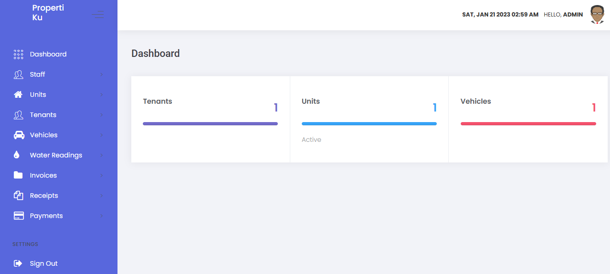
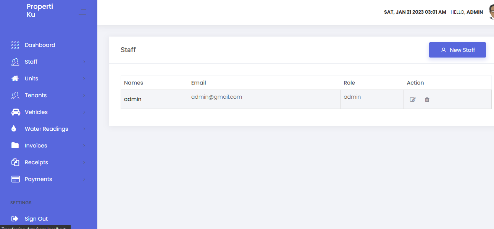
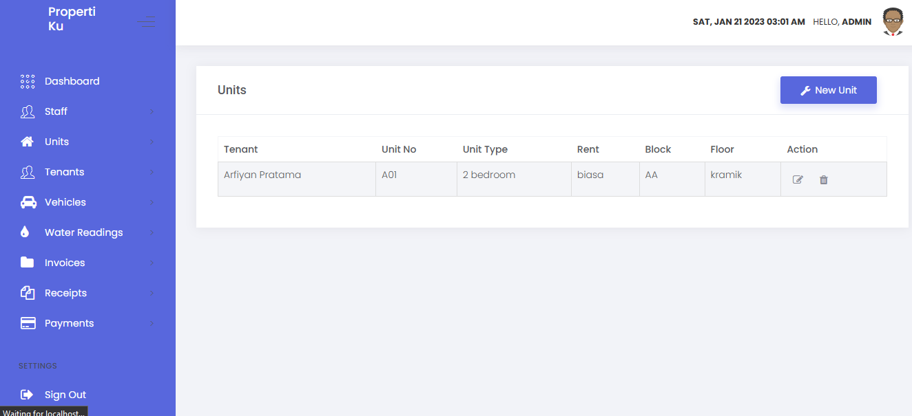
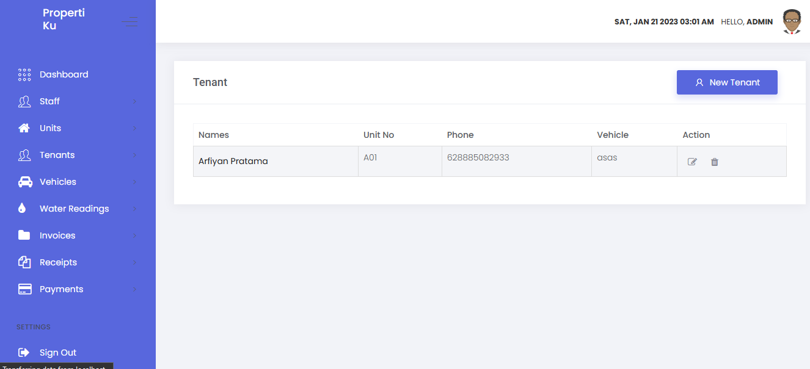
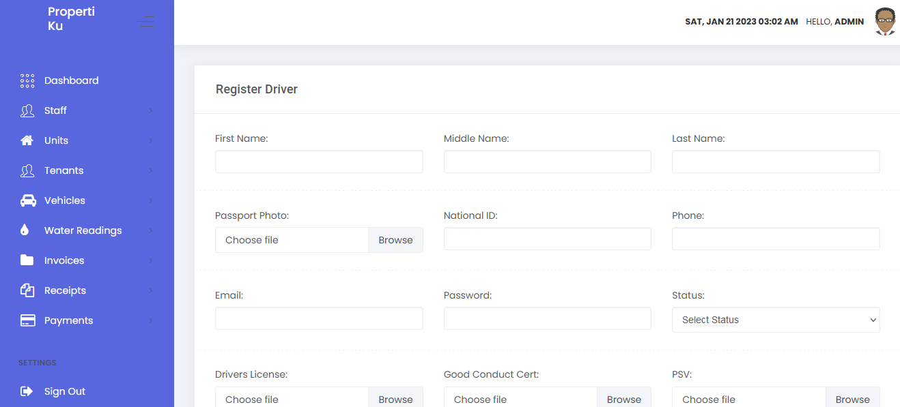

# Properti Manajemen

step2
-git clone

-   composer install
-   seting env
-   migrate dan seeder

# TAMPILAN

MENUB DASHBOARD ADMIN  
  
MENU STAFF ADMIN  
  

MENU UNIT  
  

MENU PENYEWA  
  

MENU REGISTER DRIVER  
  
